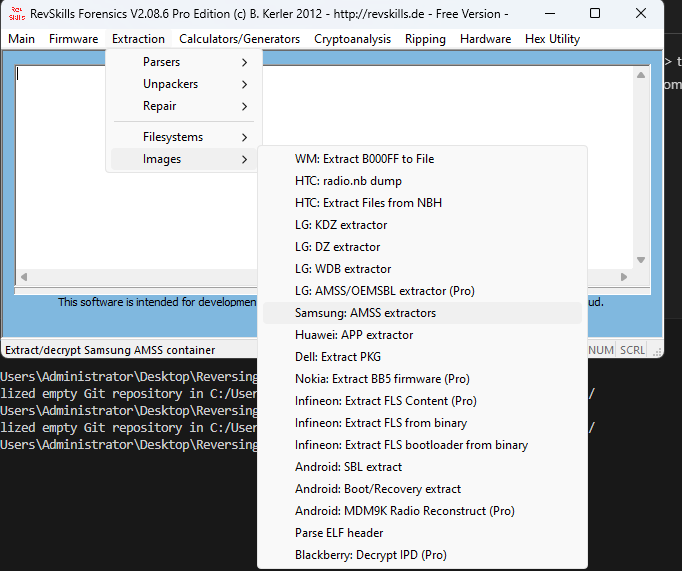

# The different files of the phone's firmware

amss_compressed.bin -> the main OS code , as it's name suggests it's compressed. To decompress it I used the tool named revskills. (you can get it here https://mega.nz/folder/2aoVnJJJ#ovZJG4cbvIOqLVEJBHrQSQ/file/2aoWQCaK)


After that you have the full os ready, you can just darg & drop into ida pro & start reversing.

NOTE : I found out that this system is based on the BADA framework that was later used in Samsung WAVE models , i managed to find out some headers of it. Samsung refused to open source the code of the phone when i asked them.

CSC_B2710_Open_Europe_Slav.csc - idk , localization stuff ???

FactoryFs_B2710_Open_Europe_Slav.ffs - base filesystem - ntfs - can be opened with WinImage

Rsrc_B2710_Open_Europe_Slav.rc1 - resources - i would need to write a tool to open them

ShpApp.app - the web-kit web browser (which is a elf .dll) and 2 .so files - can be extracted with this : https://xdaforums.com/t/simple-tool-for-viewing-of-bada-firmware.1028714/


## Bootfiles
Qualcomm uses the mbn format for their boot stuff , i think there's plugins for ida pro but idk if they work , i didnt manage to have them worked. I used readmbn with WSL to extract to code sections and open them in ida pro.

dbl.mbn - device boot loader - ```The Device Boot Loader is often the first stage of the bootloader, responsible for initializing essential hardware components, such as memory and clocks, and setting up the environment for the subsequent stages of the boot process. It's also involved in security checks and may verify the authenticity of the next bootloader stage (e.g., FSBL).``` (ChatGPT)

fsbl.bin - ```fsbl (First Stage Boot Loader): The First Stage Boot Loader follows the Device Boot Loader and is responsible for more advanced initialization and configuring system components. It's usually tasked with loading the second-stage bootloader (OSBL) or a bootable image (like an operating system kernel) into memory.```

osbl.bin - ```osbl (Operating System Boot Loader): The Operating System Boot Loader is the third stage of the bootloader process. It's responsible for initializing the device to a point where it can load and start the operating system kernel. The OSBL may perform tasks like memory setup, hardware initialization, and security checks before launching the operating system.```